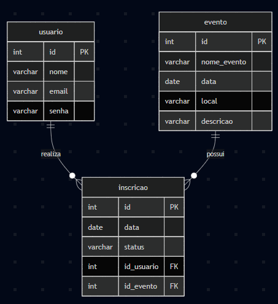

# Web Application Document - Projeto Individual - Módulo 2 - Inteli

## Organized

#### Lívia Negrini

## Sumário

1. [Introdução](#c1)  
2. [Visão Geral da Aplicação Web](#c2)  
3. [Projeto Técnico da Aplicação Web](#c3)  
4. [Desenvolvimento da Aplicação Web](#c4)  
5. [Referências](#c5)  

 

## 1. Introdução (Semana 01)

Este projeto de plataforma web para gerenciamento de eventos tem o objetivo de simplificar e otimizar todo o processo para os organizadores e participantes. Para os organizadores, a plataforma oferece uma maneira centralizada de gerenciar eventos, desde a criação até o acompanhamento das inscrições. Com funcionalidades para editar, visualizar e remover inscrições, os organizadores poderão administrar os eventos de forma prática, economizando tempo e recursos, e evitando erros comuns em processos manuais. Isso facilita a organização de eventos de qualquer porte e melhora a logística de controle dos participantes.

Para os participantes, a plataforma oferece uma experiência mais simples e acessível, permitindo que encontrem facilmente os eventos disponíveis e se inscrevam com poucos cliques. Eles receberão confirmações rápidas e terão uma visão clara de suas inscrições, tornando o processo muito mais transparente e ágil. Isso não só aumenta a acessibilidade dos eventos, como também permite uma melhor comunicação entre organizadores e participantes. Em conjunto, essa plataforma pode transformar a maneira como os eventos são gerenciados, tornando a experiência mais eficiente, organizada e amigável para todos os envolvidos.

---

## 2. Visão Geral da Aplicação Web

### 2.1. Personas (Semana 01 - opcional)

*Posicione aqui sua(s) Persona(s) em forma de texto markdown com imagens, ou como imagem de template preenchido. Atualize esta seção ao longo do módulo se necessário.*

### 2.2. User Stories (Semana 01 - opcional)

*Posicione aqui a lista de User Stories levantadas para o projeto. Siga o template de User Stories e utilize a referência USXX para numeração (US01, US02, US03, ...). Indique todas as User Stories mapeadas, mesmo aquelas que não forem implementadas ao longo do projeto. Não se esqueça de explicar o INVEST de 1 User Storie prioritária.*

---

## 3. Projeto da Aplicação Web

### 3.1. Modelagem do banco de dados  (Semana 3)

O diagrama de modelo relacional é uma representação visual da estrutura do banco de dados, mostrando as tabelas, seus atributos e os relacionamentos entre elas. Ele facilita o entendimento de como os dados são organizados e conectados, servindo como base para a implementação no sistema e garantindo a integridade das informações.

  Diagrama de modelo relacional 
   
  Fonte: da própria autora

O modelo lógico de um banco de dados é uma representação estruturada dos dados e seus relacionamentos, que descreve como as informações serão organizadas, categorizadas e conectadas, com base nas regras de negócio do sistema. Ele detalha entidades, atributos e relacionamentos, sem considerar ainda aspectos físicos de armazenamento, servindo como base para a futura implementação no modelo físico do banco de dados.

  Diagrama de modelo lógico 
   
  Fonte: da própria autora

O modelo físico de banco de dados descreve como os dados serão armazenados e organizados no sistema, focando na eficiência e no desempenho. Ele define a estrutura das tabelas, como as colunas serão armazenadas, a criação de índices para agilizar buscas e a organização dos relacionamentos entre as tabelas. O objetivo principal é garantir que o banco de dados funcione de forma rápida e eficaz, otimizando o acesso e manipulação dos dados.

[Veja o modelo físico deste projeto](https://github.com/livianegrini/Organized/blob/main/migrations/202505091133_usuarios.sql)

Ter modelos relacional, lógico e físico bem definidos em um projeto de banco de dados é essencial para garantir eficiência, escalabilidade e integridade. O modelo relacional organiza as conexões entre as tabelas, evitando redundâncias. O modelo lógico define a estrutura dos dados de forma abstrata, enquanto o modelo físico otimiza o armazenamento e desempenho. Juntos, esses modelos asseguram um sistema rápido, confiável e fácil de manter, além de permitir futuras expansões ou modificações.

### 3.1.1 BD e Models (Semana 5)
Models são responsáveis por representar e estruturar os dados da aplicação. Eles definem as regras, os formatos e as validações necessárias para garantir que as informações manipuladas no sistema estejam corretas e consistentes. Em sistemas baseados em camadas, os models servem como base para a lógica de negócios, facilitando o controle e a manutenção dos dados.

Models desse projeto:

Model Evento (models/eventoModel.js):
Validação de dados utilizando a biblioteca Joi para garantir integridade nas operações de criação e edição de eventos.

Campos:
- id: número inteiro positivo (opcional).
- nome_evento: string obrigatória (mín. 3 caracteres).
- data: data obrigatória no formato ISO.
- local: string obrigatória (mín. 3 caracteres).
- descricao: string opcional.

Model Inscrição (models/inscricao.js):
Classe que representa uma inscrição feita por um usuário em um evento.

Atributos:
- id: identificador da inscrição.
- data: data da inscrição.
- status: status atual (ex: confirmada, pendente).
- id_usuario: identificador do usuário inscrito.
- id_evento: identificador do evento vinculado.

Model Usuário (models/usuarioModel.js):
Classe de validação com Joi para dados de usuários no momento de cadastro ou edição.

Campos:
- id: número inteiro positivo.
- nome: string obrigatória (mín. 3 caracteres).
- email: string obrigatória no formato de e-mail.
- senha: string obrigatória (mín. 6 caracteres).

O uso de models no sistema permite uma separação clara de responsabilidades, mantendo a lógica de dados isolada e validada. Isso aumenta a confiabilidade da aplicação, facilita futuras manutenções e garante que apenas informações coerentes sejam processadas. 

### 3.2. Arquitetura (Semana 5)

*Posicione aqui o diagrama de arquitetura da sua solução de aplicação web. Atualize sempre que necessário.*

**Instruções para criação do diagrama de arquitetura**  
- **Model**: A camada que lida com a lógica de negócios e interage com o banco de dados.
- **View**: A camada responsável pela interface de usuário.
- **Controller**: A camada que recebe as requisições, processa as ações e atualiza o modelo e a visualização.
  
*Adicione as setas e explicações sobre como os dados fluem entre o Model, Controller e View.*

### 3.3. Wireframes (Semana 03 - opcional)

*Posicione aqui as imagens do wireframe construído para sua solução e, opcionalmente, o link para acesso (mantenha o link sempre público para visualização).*

### 3.4. Guia de estilos (Semana 05 - opcional)

*Descreva aqui orientações gerais para o leitor sobre como utilizar os componentes do guia de estilos de sua solução.*

### 3.5. Protótipo de alta fidelidade (Semana 05 - opcional)

*Posicione aqui algumas imagens demonstrativas de seu protótipo de alta fidelidade e o link para acesso ao protótipo completo (mantenha o link sempre público para visualização).*

### 3.6. WebAPI e endpoints (Semana 05)

Uma Web API permite que diferentes sistemas se comuniquem pela internet usando requisições HTTP. Ela conecta o frontend ao backend para enviar e receber dados.

Endpoints são os caminhos da API que realizam ações específicas, como listar usuários ou cadastrar eventos, usando métodos como GET, POST, PUT e DELETE.

Endpoints deste projeto:

👤 Usuários
GET /usuario — Lista todos os usuários
GET /usuario/:id — Retorna um usuário específico
POST /usuario — Cria um novo usuário
PUT /usuario/:id — Atualiza os dados de um usuário
DELETE /usuario/:id — Deleta um usuário

📅 Eventos
GET /evento — Lista todos os eventos
GET /evento/:id — Retorna um evento específico
POST /evento — Cria um novo evento
PUT /evento/:id — Atualiza os dados de um evento
DELETE /evento/:id — Deleta um evento

📝 Inscrições
GET /inscricao — Lista todas as inscrições
GET /inscricao/:id — Retorna uma inscrição específica
POST /inscricao — Cria uma nova inscrição
PUT /inscricao/:id — Atualiza uma inscrição
DELETE /inscricao/:id — Deleta uma inscrição

### 3.7 Interface e Navegação (Semana 07)

*Descreva e ilustre aqui o desenvolvimento do frontend do sistema web, explicando brevemente o que foi entregue em termos de código e sistema. Utilize prints de tela para ilustrar.*

---

## 4. Desenvolvimento da Aplicação Web (Semana 8)

### 4.1 Demonstração do Sistema Web (Semana 8)

*VIDEO: Insira o link do vídeo demonstrativo nesta seção*
*Descreva e ilustre aqui o desenvolvimento do sistema web completo, explicando brevemente o que foi entregue em termos de código e sistema. Utilize prints de tela para ilustrar.*

### 4.2 Conclusões e Trabalhos Futuros (Semana 8)

*Indique pontos fortes e pontos a melhorar de maneira geral.*
*Relacione também quaisquer outras ideias que você tenha para melhorias futuras.*

## 5. Referências

_Incluir as principais referências de seu projeto, para que o leitor possa consultar caso ele se interessar em aprofundar._ 

---
---
